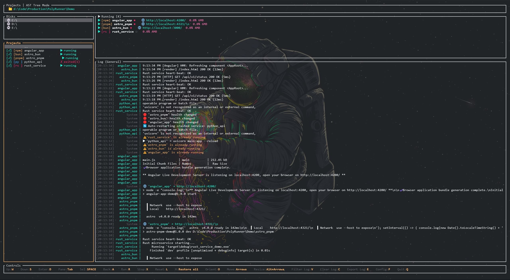
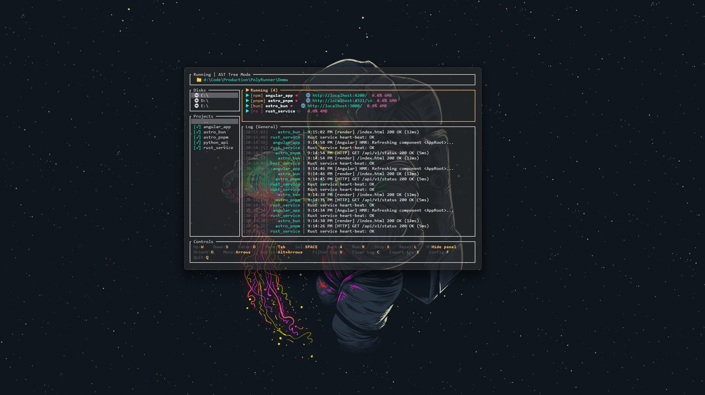

# PolyRunner 🚀

**PolyRunner** is a professional, high-performance **Multi-Pane TUI** project manager and service monitor built in Rust. Supervise, run, and explore your entire workspace from a single interactive dashboard.

---

  
  

## ✨ Highlights

*   **⚡ Real-time Dashboard**: Interactive multi-pane TUI for concurrent service monitoring.
*   **📊 Live Telemetry**: Dynamic CPU and Memory tracking for every active project.
*   **🛡️ Service Resilience**: Automated failure detection and smart auto-restarts.
*   **⌨️ Productivity First**: Ergonomic `WASD` navigation and instant filtering (`/`).
*   **🔄 Bulk Launch**: Mark multiple services with `Space` and start them in one go.
*   **⭐ Favorites**: Pin important projects for instant access across any directory.
*   **📱 Responsive & Flexible**: Auto-adjusting layouts and custom window splits.

---

## 📦 Quick Start

### Installation
Choose your preferred method:

| Platform / Manager | Command |
| :--- | :--- |
| **Linux & macOS** | `curl -LsSf https://github.com/Daviz2402/PolyRunner/releases/download/v0.2.1/polyrunner-installer.sh | sh` |
| **Windows (PS)** | `irm https://github.com/Daviz2402/PolyRunner/releases/download/v0.2.1/polyrunner-installer.ps1 | iex` |
| **Bun / Node** | `bun x polyrunner@latest` |
| **Cargo (Rust)** | `cargo install polyrunner` |

---

## ⌨️ Essential Controls

| Key | Action |
| :--- | :--- |
| **`W / S`** | Navigate selection |
| **`Tab`** | Cycle between focused panels |
| **`D / A`** | Enter directory / Go back |
| **`R / X`** | Start / Stop selected project(s) |
| **`Space`** | Toggle selection for multi-launch |
| **`F`** | Toggle Favorite status for current project |
| **`.`** | Open settings file |
| **`/`** | Focus filter/search input |
| **`V`** | Cycle Log View (General / Project Specific) |
| **`C`** | Clear active log |
| **`L`** | Re-layout active panel (auto-split) |
| **`H`** | Hide current panel |
| **`Q`** | Quit application |

---

## 🛠️ Requirements
- Modern terminal (Windows Terminal, Alacritty, iTerm2, etc.)
- Local runtimes for your projects (Bun, Node, Cargo, Python, etc.)

---

## 📄 License
Licensed under the **MIT License**.

